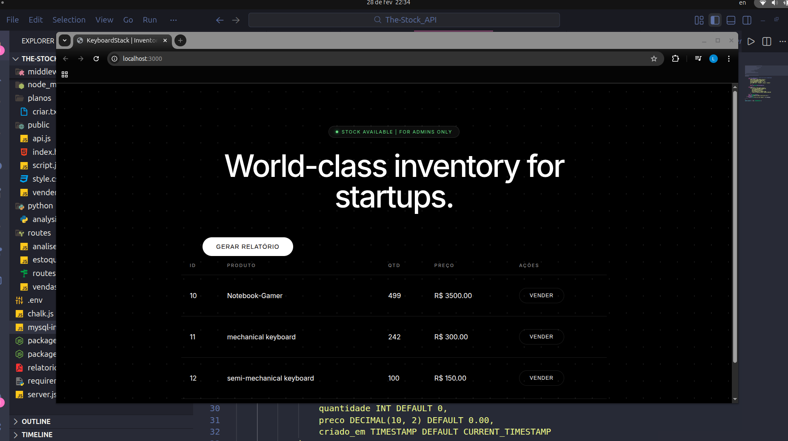

# ⌨️ KeyboardStack API + Data Intelligence


An efficient REST API designed to manage mechanical keyboard inventory with integrated Python data intelligence for automatic report generation.

<div align="center">
  
</div>

## 🚀 Features

- **Inventory Management:** Full CRUD for keyboard stocks.
- **Sales Logic:** Automated stock decrease with validation.
- **Data Intelligence:** Integrated Python script that analyzes stock levels.
- **PDF Reporting:** Automatic generation of PDF reports for items with low stock.
- **Auto-Setup:** Automatic MySQL table initialization on startup.

## 🛠️ Technologies

- **Backend:** Node.js & Express.js
- **Data Science/BI:** Python 3 (using `FPDF` & `mysql-connector`)
- **Database:** MySQL
- **Environment:** Dotenv for secure credential management

## 🛣️ API Endpoints

| Method | Endpoint | Description |
| :--- | :--- | :--- |
| `GET` | `/estoque` | Returns all items from the database |
| `POST` | `/estoque` | Adds a new product |
| `PATCH` | `/estoque/vender/:id` | Decreases quantity by 1 |
| `DELETE` | `/estoque/:id` | Removes a product |
| `GET` | `/analise/gerar-pdf` | **[NEW]** Triggers Python script to generate/view PDF report |

## 🏁 How to Run
1. **Clone the repository:**
   ```bash
   git clone https://github.com/LeonardoCides/KeyboardStack-API
   ```
2. **Install Dependencies:**
``` bash
   npm install
```
4. **Install Python Dependencies::**
   ``` bash
   pip install mysql-connector-python python-dotenv fpdf
   ```
5. **Setup Environment Variables:**
   Create a .env file in the root directory:
   ```bash
   DB_HOST=localhost
   DB_USER=root
   DB_PASS=your_password
   DB_NAME=sistema_estoque
   PORT=3000
   ```
6. **Start the server**:
   ```bash
   npm start
   ```
